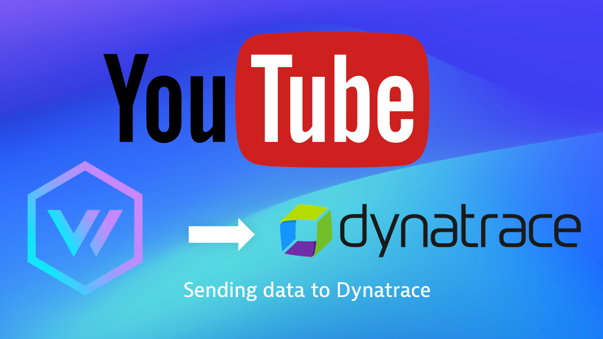
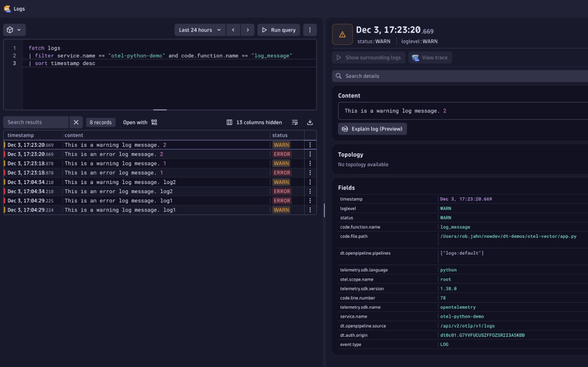
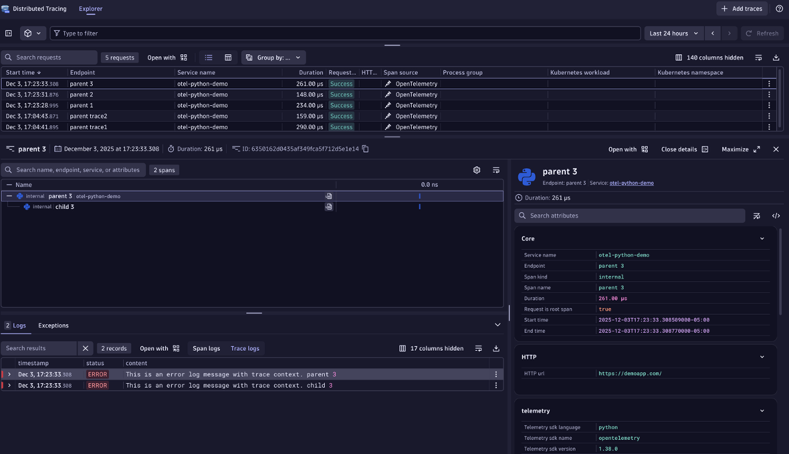
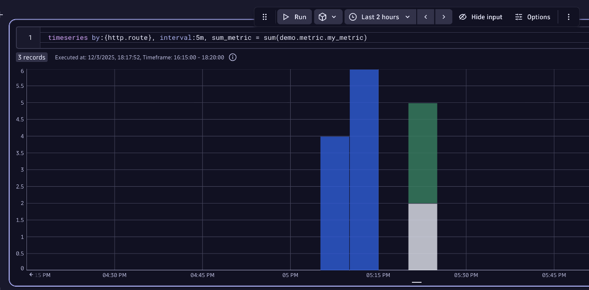

# Overview

This repo is used to demonstrate how to configure [Vector](https://vector.dev) data Sinks to [Dynatrace](https://dynatrace.com).

This assumes installation of Git, Python, and Docker / Podman running on your laptop, but it can be adapted run on another locations such as EC2 with Amazon Linux.

To try out the demo, you will need to have a few terminal windows open. You can re-use terminals between trying out the demos.
* Demo of HTTP Logs
  * terminal 1 - to run Python script (log.py) - writes logs to `app.log` file in the root folder
  * terminal 2 - to start Vector using Docker - Vector config is in the `logs` sub-folder 
* Demo of OTEL Data - Logs and Traces
  * terminal 1 - to start Python Web App (app.py) - Flask based web app running on port 5000 
  * terminal 2 - to start Vector using Docker - Vector config is in the `otel` sub-folder
  * terminal 3 - to run curl command to send requests to sample app `/logs` and `/traces` endpoints
* Demo of OTEL Data - Logs, Traces and Metrics
  * terminal 1 - to start Python Web App (app.py) - Flask web app running on port 5000 
  * terminal 2 - to start Vector using Docker - Vector config is in the `otel-collector` sub-folder
  * terminal 3 - to start OpenTelemetry Collector using Docker - Otel config is in the `otel-collector` sub-folder
  * terminal 4 - to run curl command to send requests to sample app `/logs` and `/traces` endpoints


## Overview YouTube Video

[](https://www.youtube.com/watch?v=0QTAD4jvIhA)

[YouTube Video](https://www.youtube.com/watch?v=0QTAD4jvIhA)

# Setup

### Step 1: Clone Repo

Clone this Repo and navigate to base folder of the cloned repo

```
git clone https://github.com/dt-demos/otel-vector.git
cd otel-vector
```

### Step 2: Create Dynatrace API Token

This demo will send data to the [Dynatrace Log Ingest API](https://docs.dynatrace.com/docs/discover-dynatrace/references/dynatrace-api/environment-api/log-monitoring-v2/post-ingest-logs) and the [Dynatrace OTLP API](https://docs.dynatrace.com/docs/ingest-from/opentelemetry/otlp-api)

You can just make one Dynatrace API Token with these scopes from the `Access Tokens` page within Dynatrace.
* `openTelemetryTrace.ingest`
* `metrics.ingest`
* `logs.ingest`

### Step 3: Update Environment Variables

Your Dynatrace environment and API token need to be saved to an `.env` file. The Vector configuration file refers to these variables.

To do this, first copy this template file and then edit the `.env` file for the Dynatrace tenant and the API token created in the previous step.

```
cp .env-template .env
```

### Step 4: Install Python dependencies

This example assumed the use an [Python Virtual Environment](https://www.w3schools.com/python/python_virtualenv.asp) as to isolate the required Python packages.

To make virtual environment and install pacakges, run these commands.

```
# make virtual environment 
python3 -m venv otel-vector

# activate a project environment 
source otel-vector/bin/activate

# install pacakges into project environment 
pip install -r requirements.txt 
```

# Demo of HTTP Logs

In this demo, you will start up vector with the configuration to send logs to the [Dynatrace Log Ingest API](https://docs.dynatrace.com/docs/discover-dynatrace/references/dynatrace-api/environment-api/log-monitoring-v2/post-ingest-logs).

The way data is sent to Dynatrace for this guide is as follows:

```
Python Sample App 
   --> Vector Log File source (app.log)
          --> Logs --> Vector HTTP Sink --> Dynatrace HTTP Logs API endpoint
```

### Step 1: Start Vector

In a seperate terminal, run these commands.  Enter `ctrl-c` to exit the program when done your demo.  

```
# this is log file the python script makes and docker needs to map to
touch app.log

# set environment variables
source .env

# start vector
podman run \
  --rm \
  -v $PWD/logs/vector.yaml:/etc/vector/vector.yaml \
  -v $PWD/app.log:/etc/vector/app.log \
  -e APP_LOG_DIR=/etc/vector \
  -e VECTOR_LOG=$VECTOR_LOG \
  -e DT_BASE_URL=$DT_BASE_URL \
  -e DT_API_TOKEN=$DT_API_TOKEN \
  -p 8686:8686 \
  --name vector \
  timberio/vector:0.51.1-debian
```

### Make a test log with Python script

The vector config is looking for a `app.log` file and each time a row is added, it will send to Dynatrace. To simulate logs, in another terminal and in the base folder of the repo, make some logs by calling this Python script that will append a JSON log line to `app.log`

```
python log.py
```

Optionally, add a custom log string as an argument

```
python log.py "my log 1"
```

Within Dynatrace, you can verify logs in the `Logs App` with a DQL statment such as this.  

```
fetch logs
| filter service.name == "otel-python-demo" and code.function.name == "log_message"
| sort timestamp desc
```



# Demo of OTEL Data - Logs and Traces

In this demo, you will start up vector with the configuration to send data to the [Dynatrace OTLP API](https://docs.dynatrace.com/docs/ingest-from/opentelemetry/otlp-api).  

However, [due to the way Vector converts metrics to logs](https://vector.dev/docs/reference/configuration/sources/opentelemetry/#use_otlp_decoding), metrics can not be directly sent to Dynatrace.  What is required, is the Vector OpenTelemtry sink for Metrics needs to send them to an OpenTelemetry Collector first.  Then in the OpenTelemetry Collector, metrics can be exported to Dynatrace.  

In next guide, only show Logs and Traces.  And in the next guide following, the setup with the OpenTelemetry Collector will be shown.

The way data is sent to Dynatrace for this guide is as follows:

```
Python Sample App 
   --> Vector OpenTelemetry Source
          --> Logs --> Vector OpenTelemetry Sink --> Dynatrace OTLP Logs API endpoint
          --> Traces --> Vector OpenTelemetry Sink --> Dynatrace OTLP Traces API endpoint
```
### Step 1: Start Vector

In a seperate terminal, run this command.  Enter `ctrl-c` to exit the program when done your demo.  

```
# set environment variables
source .env

# start vector
podman run \
  --rm \
  -v $PWD/otel/vector.yaml:/etc/vector/vector.yaml \
  -v $PWD/app.log:/etc/vector/app.log \
  -e VECTOR_LOG=$VECTOR_LOG \
  -e DT_BASE_URL=$DT_BASE_URL \
  -e DT_API_TOKEN=$DT_API_TOKEN \
  -p 8686:8686 -p 4317:4317 -p 4318:4318 \
  --name vector \
  timberio/vector:0.51.1-debian
```

### Step 2: Start Sample App

To start the Python app, run this command in a seperate terminal.  This web app will listen on port 5000 for http requests.

```
python3 app.py 
```

You will keep this running in one of your terminal windows.  Enter `ctrl-c` to exit the program.

### Step 3: Make a test log 

In another terminal and in the base folder of the repo, make some logs by running this command.  The `q` querystring is the content for the log

```
curl http://localhost:5000/log?q=test_log
```

Within Dynatrace, you can verify logs in the `Logs App` with a DQL statment such as this. If you adjust the value of `q`, then adjust the DQL filter too.

```
fetch logs
| filter service.name == "otel-python-demo" and code.function.name == "trace_message"
| sort timestamp desc
```

### Step 4: Make a test span

In another terminal and in the base folder of the repo, make some logs by running this command.  The `q` querystring is the name of the trace request.

```
curl http://localhost:5000/trace?q=test_span
```

Within Dynatrace, you can verify logs in the `Distributed Traces App`



# Demo of OTEL Data - Logs, Traces and Metrics

In this demo, you will start up vector with the configuration to send data to the [Dynatrace OTLP API](https://docs.dynatrace.com/docs/ingest-from/opentelemetry/otlp-api). 

However, [due to the way Vector converts metrics to logs](https://vector.dev/docs/reference/configuration/sources/opentelemetry/#use_otlp_decoding), metrics can not be directly sent to Dynatrace.  What is required, is the Vector OpenTelemtry sink for Metrics needs to send them to an OpenTelemetry Collector first.  Then in the OpenTelemetry Collector, metrics can be exported to Dynatrace.  

The way data is sent to Dynatrace for this guide is as follows:

```
Python Sample App 
   --> Vector OpenTelemetry Source
          --> Logs --> Vector OpenTelemetry Sink --> Dynatrace OTLP Logs API endpoint
          --> Traces --> Vector OpenTelemetry Sink --> Dynatrace OTLP Traces API endpoint
          --> Metrics --> Vector OpenTelemetry Sink --> Otel Collector Reciever --> Otel Collector Exporter to Dynatrace OTLP Metrics API endpoint
```

### Step 1: Start Vector

In a seperate terminal, run this command.  Enter `ctrl-c` to exit the program when done your demo.  

```
# set environment variables
source .env

# otel with metrics
podman run \
  --rm \
  -v $PWD/otel-collector/vector.yaml:/etc/vector/vector.yaml \
  -v $PWD/app.log:/etc/vector/app.log \
  -e VECTOR_LOG=$VECTOR_LOG \
  -e DT_BASE_URL=$DT_BASE_URL \
  -e DT_API_TOKEN=$DT_API_TOKEN \
  -p 8686:8686 -p 4317:4317 -p 4318:4318 \
  --name vector \
  timberio/vector:0.51.1-debian
```

### Step 3: OpenTelemetry Collector 

In a seperate terminal, run the following commmands.  Enter `ctrl-c` to exit the program when done your demo. 

```
# set environment variables
source .env

# start the OpenTelemetry Collector 
podman run \
  -e DT_BASE_URL=$DT_BASE_URL \
  -e DT_API_TOKEN=$DT_API_TOKEN \
  -v "${PWD}/otel-collector/otelcol-config.yaml":/etc/otelcol/config.yaml \
  -p 5318:5318 \
  otel/opentelemetry-collector-contrib --config /etc/otelcol/config.yaml
```

### Step 4: Start Sample App

Follow the guide in the previous section to start the sample app.

### Step 5: Make a test log and spans

Follow the guide in the previous section to send in data and review results

### Step 6: Review metrics

The Demo metric has the name `demo.metric.my_metric`.  To view the metrics, use a Dynatrace notebook and the Dyantrace Query Language (DQL) as a start.

```
timeseries interval:5m, sum_metric = sum(demo.metric.my_metric)
```

And split by endpoint

```
timeseries by:{http.route}, interval:5m, sum_metric = sum(demo.metric.my_metric)
```


